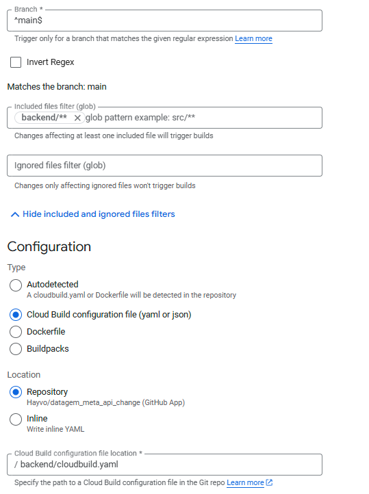

# Project Setup and Deployment Guide

This guide provides instructions on setting up a Flask + SQLAlchemy application, explaining the folder structure, and deploying it on Google Cloud Build with triggers and artifact registry.

## Folder Structure

```
backend/
│   ├── models/                 # Database models
│   ├── routes/                 # Flask route definitions
│   ├── __init__.py             # Package initializer
│   ├── app.py                  # Main Flask application
│   ├── cloudbuild.yaml         # Cloudbuild file for GCP deployment
│   ├── config.py               # Config constants
│   ├── Dockerfil               # Dockerfile for container
│   ├── requirements.txt        # Python depandencies
└───└── .env.template           # Environment variable template
```

## Setting Up Flask + SQLAlchemy

1. **Install Dependencies**
   Ensure you have Python and pip installed. Then, install the required packages:

   ```bash
   pip install Flask Flask-Cors Flask-JWT-Extended Flask-Migrate Flask-SQLAlchemy python-dotenv
   ```

2. **Configure Environment Variables**
   Copy the `.env.template` to `.env` and fill in the required configuration values (e.g., `JWT_SECRET_KEY`, `SQLALCHEMY_DATABASE_URI`).

    To create a Google Client ID visit the Credentials page on your GCP project. Here is a [complete tutorial](https://dev.to/pikkue/create-google-login-credentials-for-your-web-application-3dc2).

3. **Initialize Database**
   Run the following command to set up the initial database schema:

   ```bash
   python -m flask db init
   python -m flask db migrate
   python -m flask db upgrade
   ```

## Deploying on Cloud Build

### Step 1: Configure Cloud Build

1. **Create a Cloud Build Trigger**
   - Go to the Cloud Build Triggers page in the Cloud Console.
   - Click "Create Trigger".
   - Select your source repository and branch (e.g., `main`).
  
    Since this repository contains both the frontend and the backend we have to setup the trigger to only build when code is pushed to the backend folder. 

    

2. **Reference the Cloud Build Configuration**
   - Ensure the `cloudbuild.yaml` file is present in your backend root.
   - The file should contain steps to build, push, and deploy your Docker containers.
   - In the `cloudbuild.yaml` file, rename `YOUR-APP-NAME` and `YOUR-PROJECT-ID` to your actual app name and project ID.

### Step 2: Setup Artifact Registry

1. **Create an Artifact Registry Repository**
   - Navigate to the Artifact Registry page in the Cloud Console.
   - Click "Create Repository" and select "Docker" as the type.
   - Name it appropriately (e.g., `YOUR-APP-NAME-backend`).


2. **Run the Deployment**
   - Once the Cloud Build trigger is set up, any push to your repository's main branch will automatically start the build and deployment process.

With this setup, your Flask application will be continuously deployed on Google Cloud using Cloud Build and Artifact Registry. Adjust configurations and paths as necessary to fit your project specifics. Once the deployement is finished, retrieve the backend app url and put it into the `frontend/.env` file. 

