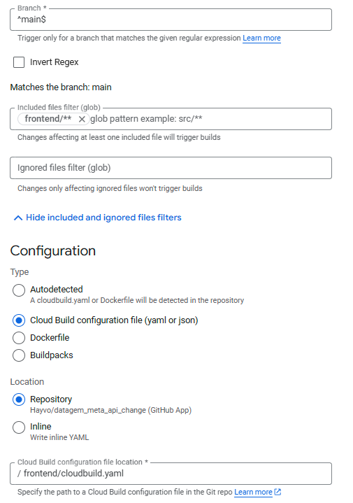

# Deploying the Frontend to Cloud Build

This is a step-by-step guide to deploying the frontend to Cloud Build.

For a tutorial on how to setup a React project with Vite + TailwindCSS take a look at the [React Setup Tutorial](VITE.md).

### Step 1: Rename the app name and project ID in cloudbuild.yaml

In the `cloudbuild.yaml` file, rename `YOUR-APP-NAME` and `YOUR-PROJECT-ID` to your actual app name and project ID.

### Step 2: Create a Build Trigger

In the Cloud Console, navigate to the Cloud Build page and click on "Create Trigger". Choose "Cloud Source Repositories" as the source and select the repository that contains your frontend code.

Since this repository contains both the frontend and the backend we have to setup the trigger to only build when code is pushed to the frontend folder. 

### Step 3: Create an Artifact Registry container for Docker

In the Cloud Console, navigate to the Artifact Registry page and click on "Create Repository". Choose "Docker" as the repository type and name it something like `YOUR-APP-NAME-frontend`.

## Conclusion 

Now your frontend will build whenever code is pushed to the main branch in the fronted folder. Once the build is finished, retrieve the frontend app URL and app it to the ALLOWED_ORIGINS in the backend `.env` file. 

